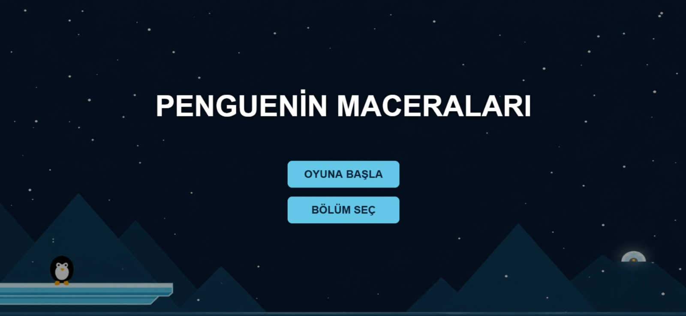
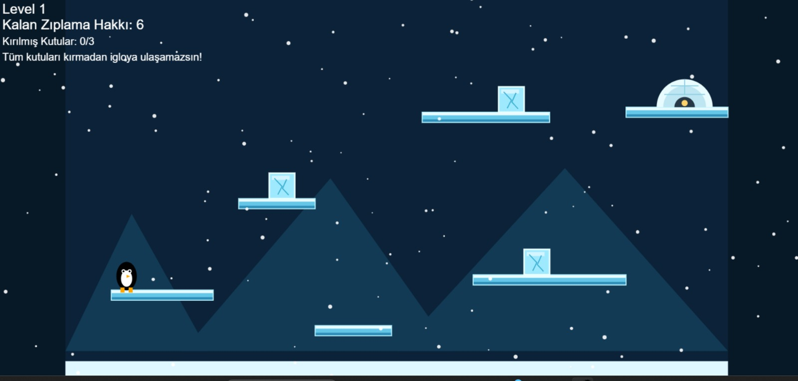
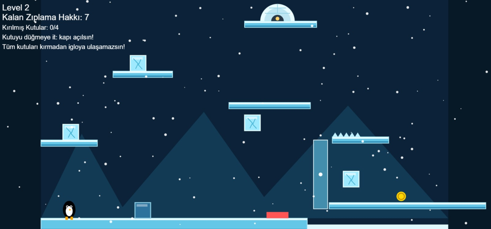
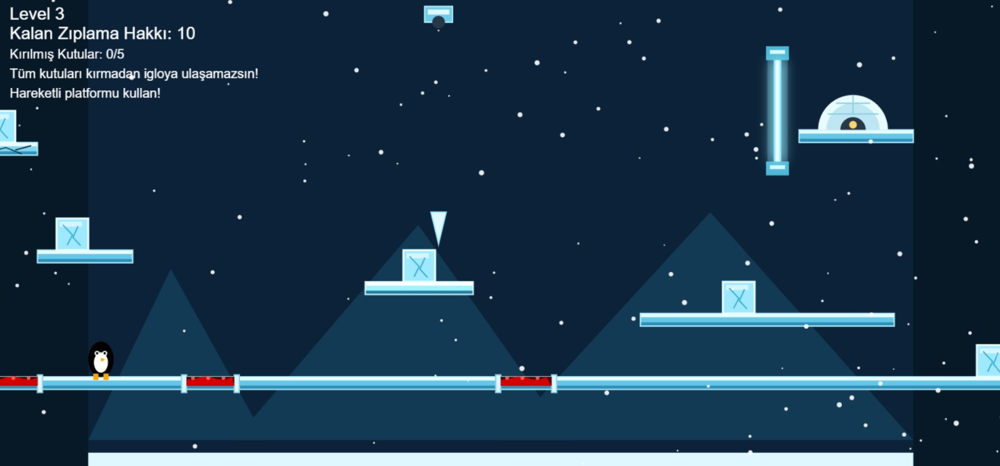

# 🐧 Penguenin Maceraları

<div align="center">



### Buzlarla kaplı platformlarda kutuları kır, engelleri aş ve igloya ulaş!

[🎮 Oyunu Oyna](https://zhale6.github.io/penguingame/) • [📁 GitHub Repo](https://github.com/ZHale6/penguingame)

</div>

---

## 📌 Proje Hakkında

**Penguenin Maceraları**, HTML, CSS ve JavaScript kullanılarak geliştirilmiş 2D platform türünde bir web oyunudur.  
Oyuncu, sevimli bir pengueni kontrol ederek buz platformları üzerinde ilerler, kutuları kırar, engellerden kaçar ve bölüm sonunda igloya ulaşmaya çalışır.

Oyunun temel amacı, her bölümde belirlenen görevleri tamamlayarak igloya ulaşmaktır. Ancak igloya ulaşmak için yalnızca sona gitmek yeterli değildir; bölümdeki tüm kırılması gereken kutuların yok edilmesi gerekir.

---

## 🎮 Canlı Demo

Oyunu tarayıcından hemen oynayabilirsin:

👉 **[Penguenin Maceraları Canlı Oyna](https://zhale6.github.io/penguingame/)**

---

## 🧊 Oyun Görselleri

### Ana Menü


### Level 1



### Level 2



### Level 3



---

## 🎯 Oyunun Amacı

Oyuncunun amacı:

- Pengueni güvenli şekilde platformlar üzerinde ilerletmek
- Bölümdeki tüm kırılabilir kutuları yok etmek
- Tuzaklardan ve engellerden kaçmak
- Zıplama hakkını doğru kullanmak
- Tüm görevleri tamamladıktan sonra igloya ulaşmak

Her bölümde farklı sayıda kutu, platform ve engel bulunur. Bölümler ilerledikçe oyun daha dikkatli hareket etmeyi gerektirir.

---

## 🕹️ Kontroller

| Tuş | İşlev |
|---|---|
| `A` / `←` | Sola hareket |
| `D` / `→` | Sağa hareket |
| `Space` / `W` / `↑` | Zıplama |
| Kutulara temas | Kutuları kırma / itme |
| Kapı ve düğmeler | Bölüm mekaniklerini aktifleştirme |

---

## 🧩 Oyun Mekanikleri

### 📦 Kırılabilir Kutular

Oyuncu, bölümdeki kutuları kırarak ilerler.  
Igloya ulaşmak için genellikle tüm kutuların kırılması gerekir.

### 🧊 Buz Platformları

Oyun, buz temalı platformlardan oluşur. Oyuncu bu platformlar üzerinde hareket eder ve zıplayarak diğer alanlara ulaşır.

### 🏠 Iglo Hedefi

Her bölümün sonunda bir iglo bulunur.  
Oyuncu, görevleri tamamladıktan sonra igloya ulaşarak bölümü bitirir.

### ⚠️ Engeller

Bazı bölümlerde dikenler, hareketli platformlar veya geçişi zorlaştıran mekanizmalar bulunur.  
Bu engeller oyuna ekstra zorluk katar.

### 🔢 Zıplama Hakkı

Her bölümde sınırlı zıplama hakkı vardır.  
Bu nedenle oyuncunun zıplamalarını dikkatli kullanması gerekir.

---

## 🏆 Bölümler

Oyunda farklı zorluk seviyelerine sahip bölümler bulunmaktadır.

| Bölüm | Zorluk | Açıklama |
|---|---|---|
| Level 1 | Kolay | Temel platformlar ve kutu kırma mekaniği |
| Level 2 | Orta | Düğme, kapı ve daha fazla kutu mekaniği |
| Level 3 | Zor | Hareketli platformlar, engeller ve daha dikkatli ilerleme |

---

## 🛠️ Kullanılan Teknolojiler

Bu proje temel web teknolojileri ile geliştirilmiştir:

- **HTML5**
- **CSS3**
- **JavaScript**
- **GitHub Pages**

---

## 🚀 Kurulum ve Çalıştırma

Projeyi kendi bilgisayarında çalıştırmak için:

```bash
git clone https://github.com/ZHale6/penguingame.git
